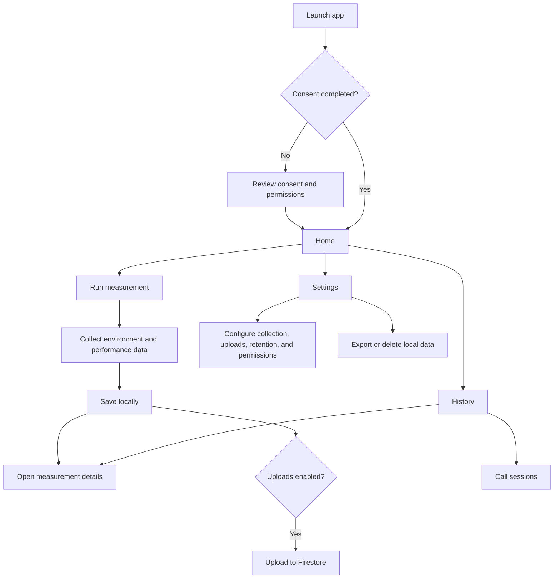
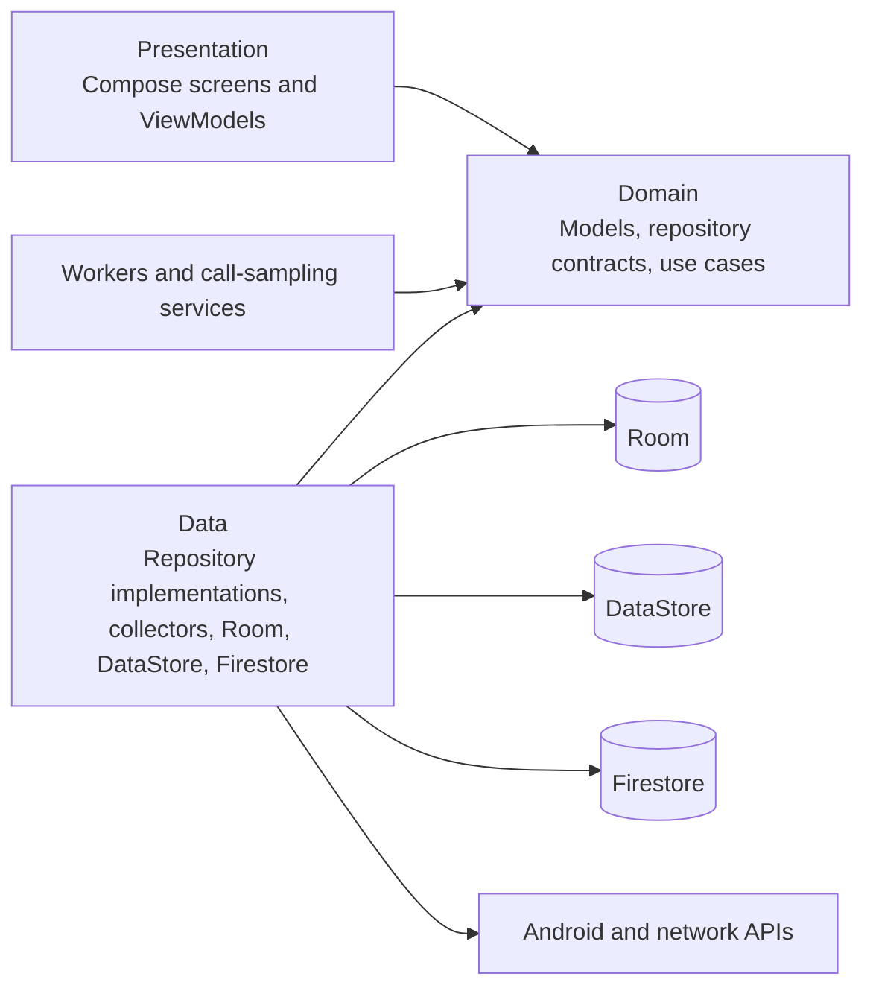

# CrowdMeasure App Overview

## What It Is

CrowdMeasure is an Android app for collecting network-quality measurements from a device. It records the device and network environment, runs lightweight HTTP performance probes, stores results locally, and can optionally upload them to Firebase Firestore.

The app can collect measurements:

- Manually from the Home screen
- Automatically in the background on a configured interval
- During cellular or generic VoIP calls, where it periodically samples cellular signal information

## Main Features

- **Network measurement:** Captures connection type, IP information, Wi-Fi or cellular details, location, device state, and HTTP performance metrics.
- **Measurement history:** Shows saved measurements, supports search and transport filtering, and provides detailed views.
- **Background collection:** Uses WorkManager to run measurements periodically under configured network and battery constraints.
- **Call sampling:** Uses a foreground service to sample cellular conditions during supported calls.
- **Optional cloud upload:** Uploads pending measurements and call sessions to Firestore.
- **Data controls:** Supports JSON export, local-data deletion, retention settings, and collection/upload preferences.

## User-Facing App Flow



The main bottom-navigation destinations are:

- **Home:** Run a measurement, view the latest result, and upload queued records.
- **History:** Browse, search, filter, and inspect saved measurements; access call sessions.
- **Settings:** Configure collection and upload behavior, inspect background-work status, export data, or delete local data.

## Measurement Flow

1. `HomeViewModel` starts `RunMeasurementUseCase`.
2. The use case delegates to `MeasurementRepository`.
3. `MeasurementRunner` collects:
   - Device and app metadata
   - Location and device environment
   - Active network, IP, Wi-Fi, and cellular information
   - HTTP performance metrics such as DNS, connect, TLS, TTFB, latency, jitter, and probe failures
4. The completed `Measurement` is stored in Room with a pending upload state.
5. The UI observes Room flows and updates the latest result, history, and queue count.
6. Manual or scheduled upload sends pending records to Firestore and marks them as uploaded.

## Background and Call Flows

### Background Collection

`WorkScheduler` is the central scheduler for WorkManager jobs:

- `AutoRunWorker` runs and stores scheduled measurements.
- `UploadWorker` uploads pending measurements.
- `CallUploadWorker` uploads completed call sessions.
- `MaintenanceWorker` removes measurements older than the configured retention period.
- `WorkRescheduleWorker` restores schedules after app start, device boot, or app update.

Background jobs apply network, battery, retry, and duplicate-run controls.

### Call Sampling

1. `PhoneStateReceiver` detects cellular call-state changes.
2. If settings and prerequisites allow it, `CallSamplingService` starts as a foreground service.
3. The service samples cellular information every five seconds and stores it in Room.
4. When the call ends, the session is finalized and a call-upload job is requested.
5. Generic VoIP calls may also be detected through audio-mode monitoring.

WhatsApp-specific notification-listener sampling is currently disabled in the manifest.

## Architecture and Layers

The app follows a layered, repository-based architecture with Hilt dependency injection.



### Presentation Layer

Location: `app/src/main/java/com/example/crowdmeasure/presentation`

- Jetpack Compose screens and reusable UI components
- Navigation and shared app shell
- Hilt ViewModels exposing reactive `StateFlow` UI state
- Screens grouped by feature: consent, home, history, call sessions, and settings

### Domain Layer

Location: `app/src/main/java/com/example/crowdmeasure/domain`

- Core models such as `Measurement`, network environment, performance data, and call sessions
- Repository interfaces that define data operations
- Small use cases for measurement, upload, history, export, deletion, and settings changes

### Data Layer

Location: `app/src/main/java/com/example/crowdmeasure/data`

- Repository implementations
- Measurement collectors and network probes
- Room database, entities, DAOs, converters, and migrations
- DataStore preferences and worker-status stores
- Firestore upload implementations
- JSON export and sharing utilities

### Platform and Background Layer

Locations:

- `app/src/main/java/com/example/crowdmeasure/workers`
- `app/src/main/java/com/example/crowdmeasure/callsampling`

This layer integrates with WorkManager, broadcast receivers, foreground services, telephony APIs, and Android lifecycle events.

### Dependency Injection

Location: `app/src/main/java/com/example/crowdmeasure/di`

Hilt modules provide repositories, Room DAOs, Firestore, WorkManager integration, dispatchers, preferences, collectors, and other application-wide dependencies.

## Project Structure

```text
app/src/main/java/com/example/crowdmeasure/
|-- callsampling/   # Call detection and foreground sampling service
|-- data/
|   |-- db/         # Room database, entities, DAOs, migrations
|   |-- export/     # JSON export and sharing
|   |-- measurement/# Measurement runner, collectors, networking
|   |-- prefs/      # DataStore preferences and status stores
|   `-- repo/       # Repository implementations
|-- di/             # Hilt dependency modules
|-- domain/
|   |-- model/      # Core application models
|   |-- repo/       # Repository contracts and settings model
|   `-- usecase/    # Application operations
|-- presentation/
|   |-- nav/        # Compose navigation and app shell
|   |-- screens/    # Feature screens and ViewModels
|   |-- ui/         # Theme and reusable components
|   `-- util/       # Permissions, settings intents, UI state
`-- workers/        # Scheduling, collection, upload, and cleanup jobs
```

## Data and Storage

- **Room database (`crowdmeasure.db`):** Stores measurements, call sessions, and call samples.
- **DataStore:** Stores app settings, consent state, generated install ID, and worker/call status.
- **Firestore:** Optional remote destination for uploaded measurements and call sessions.
- **JSON exports:** User-requested local exports shared through Android's file-sharing flow.

Measurements are local-first. Uploads are optional and controlled through settings. Local measurement cleanup is performed daily according to the configured retention period.

## Technology Summary

- Kotlin and coroutines
- Jetpack Compose and Navigation Compose
- Hilt dependency injection
- Room and DataStore
- WorkManager
- OkHttp
- Firebase Firestore, Analytics, and Crashlytics
- Android telephony, connectivity, location, and foreground-service APIs
