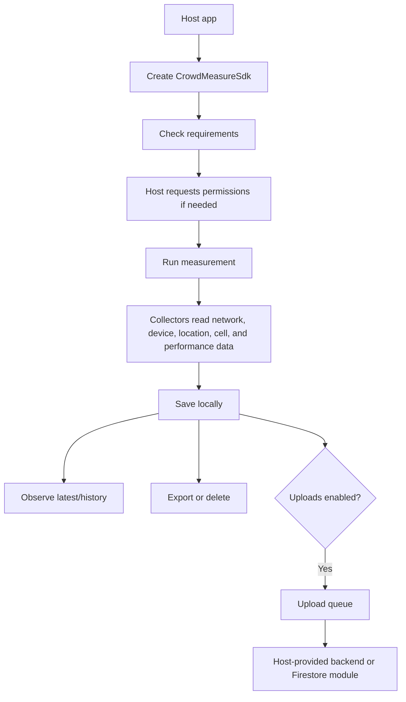

# Repository Overview

This repository contains three useful things for an Android team integrating CrowdMeasure:

- `crowdmeasure-sdk-*`: the SDK modules a host app can depend on.
- `sample-host-app`: a small app showing SDK initialization without Hilt.
- `app`: the full CrowdMeasure app, useful as a real integration reference.

The SDK is local-first. It can collect network measurements, store them on device, expose history flows, export/delete local data, optionally run background measurements, optionally upload measurements/calls, and optionally collect cellular samples during cellular or generic VoIP calls.

## Recommended Reading Order

1. [Installation](installation.md)
2. [Quick start](quick-start.md)
3. [Permissions](permissions.md)
4. [Collectors](collectors/README.md)
5. [Manual measurements](manual-measurements.md)
6. Optional features: [background collection](background-collection.md), [uploads](uploads.md), [call sampling](call-sampling.md)

## Project Structure

```text
crowdmeasure-sdk-core/                    # Manual measurements, local storage, settings, export/delete
crowdmeasure-sdk-background/              # WorkManager background measurements and retention cleanup
crowdmeasure-sdk-measurements-upload-api/ # Backend-neutral measurement uploader contracts
crowdmeasure-sdk-measurements-upload/     # Measurement upload queue and WorkManager scheduling
crowdmeasure-sdk-firestore-measurements/  # Firestore measurement uploader
crowdmeasure-sdk-calls/                   # Local cellular/VoIP call sampling and call storage
crowdmeasure-sdk-calls-upload/            # Call upload queue and WorkManager scheduling
crowdmeasure-sdk-firestore-calls/         # Firestore call uploader
sample-host-app/                          # Minimal integration example
app/                                      # Full CrowdMeasure Android app
docs/                                     # SDK and repo documentation
```

## Main Flow



## Layering

- **SDK core:** owns measurement collection, local persistence, settings, requirements, export, deletion, and shared models.
- **Optional SDK modules:** add scheduling, upload queues, Firestore uploaders, and call sampling.
- **Host app:** owns UI, consent, permission requests, Firebase initialization, analytics, Crashlytics, and product-specific policy.
- **Full CrowdMeasure app:** consumes the SDK while preserving legacy app data and screens.

## What Integrators Should Copy

Use `sample-host-app` for the clean integration shape. Use the full `app` only when you need a real example of UI, diagnostics, compatibility adapters, or legacy data migration.

Do not copy app-owned Hilt setup unless your app already uses Hilt. The SDK APIs are instance-based and do not require Hilt.
